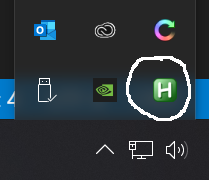

# Paste Keystokes

[](https://opensource.org/licenses/MIT)
[](http://buktenica.com)

## Overview

This project shows how to paste the contents of the clipboard to the keyboard buffer.

## Prerequisites

1. Install Chocolatey

```powershell
Set-ExecutionPolicy Bypass -Scope Process -Force; [System.Net.ServicePointManager]::SecurityProtocol = [System.Net.ServicePointManager]::SecurityProtocol -bor 3072; iex ((New-Object System.Net.WebClient).DownloadString('https://chocolatey.org/install.ps1'))
```

1. Install AutoHotkey

```powershell
choco install autohotkey -y
```

## Usage

1. Double click sendClipboard.ahk to load the hotkey. Note that the AutoHotkey icon should now be in the notification window.

  

1. Copy the text you need into the clipboard.

1. Press the windows key + v to paste the content into the windows that is needed.

1. Press the windows key + v to paste the content into the windows that is needed.
